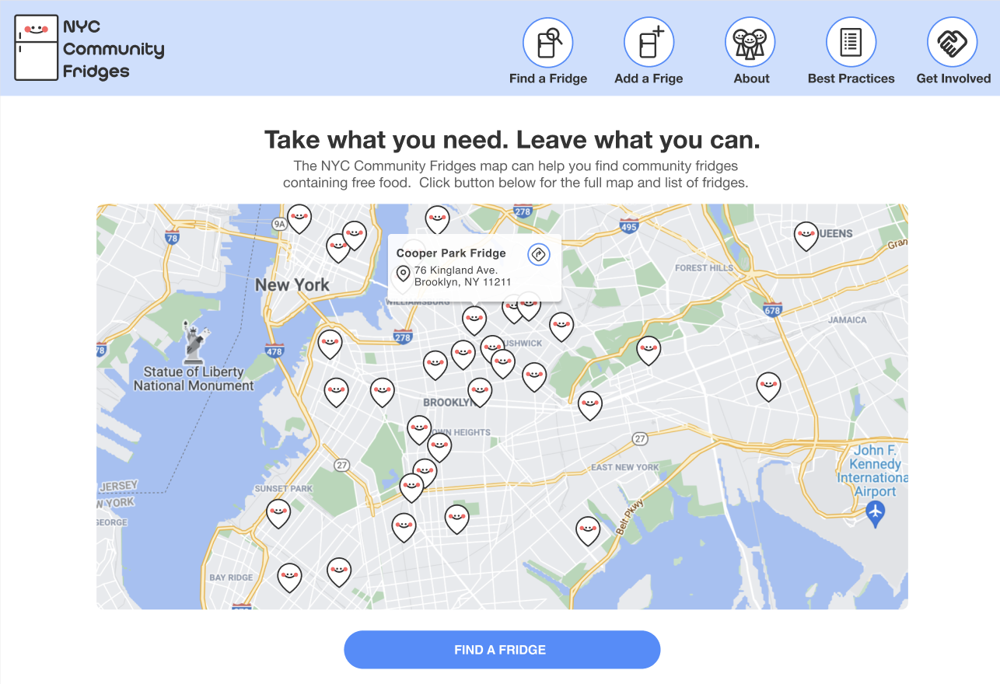

<h1> I'm Joseph</h1>

<p>My name is Joseph and I am a researcher at UCSF studying applied computational methods for improving behavioral models of social behavior in the Manoli lab. Currently, I am working on unbiased classification of behaviors by reducing high-dimensional feature sets generated by neural networks.</p>

<p>I am currently interested in high performance real-time computing in challenging environments and am currently a student at Cal State Fullerton (Fall 2022). I am also pursuing a masters degree at Indiana State University studying mathematics. </p>

<p>In my free time, I am helping to build a community fridge map application for providing low-income immigrants in NYC access to free food. <a href="https://josephmaa.github.io/website-resume/">Check out my resume here.</a></p>

<p align="center" width="100%">
  
</p>

<h3>Here are a couple tools I use</h3>
<p>
  
   
  
  
  
  
  
  
  
  
  
  
  
  
  
  
  
  
  
</p>

<!--START_SECTION:waka-->

```text
C++        2 hrs 18 mins   ███████████████████░░░░░░   75.81 %
Python     33 mins         ████▓░░░░░░░░░░░░░░░░░░░░   18.43 %
Markdown   6 mins          █░░░░░░░░░░░░░░░░░░░░░░░░   03.60 %
JSON       3 mins          ▒░░░░░░░░░░░░░░░░░░░░░░░░   01.71 %
Text       0 secs          ░░░░░░░░░░░░░░░░░░░░░░░░░   00.44 %
```

<!--END_SECTION:waka-->

```javascript
const joseph = {
  pronouns: "he" | "him",
  techCommunities: {
                        community: "CommunityFridgeMap",
                        goal: "A community fridge is a decentralized food resource. There are dozens of fridges hosted by volunteers across the New York City area."
                      },
 hobbies: "I am building an automated volleyball tracker to help professional teams automate set accuracy"
}
```

<h3>Where to find me</h3>
<p><a href="https://github.com/josephmaa" target="_blank"></a> <a href="https://twitter.com/JosephMaa2" target="_blank"></a> <a href="https://www.linkedin.com/in/joseph-m-34696aa2/" target="_blank"></a> <a href="https://medium.com/@josephgmaa" target="_blank"></a>
</p>
